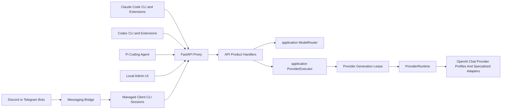
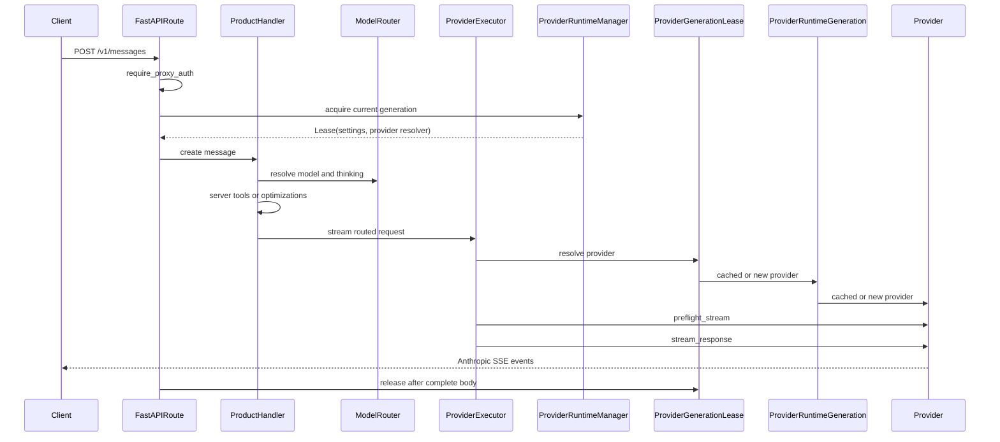
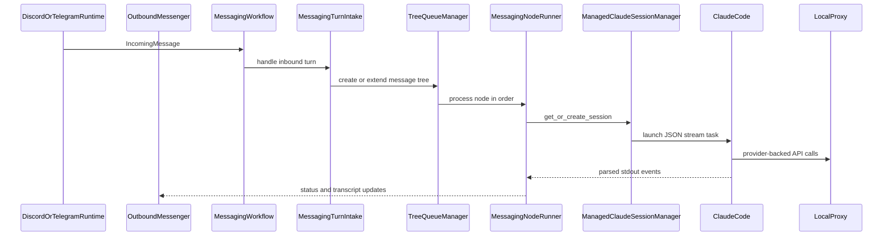

# Architecture

This document is a maintainer-oriented map of Free Claude Code. It explains the
runtime boundaries, request flows, provider abstraction, configuration model,
optional messaging bridge, and verification strategy.

For installation, provider setup, and user-facing usage, see
[README.md](README.md). This file focuses on where behavior lives in the codebase
and how contributors should extend it.

## System Overview

Free Claude Code is a local proxy for agent clients. It accepts Anthropic
Messages traffic from Claude Code and Pi clients and OpenAI Responses traffic
from Codex clients, routes the request to a configured upstream provider, and
preserves the wire protocol expected by the caller.

There are three runtime surfaces:

- HTTP proxy: FastAPI routes expose Anthropic-compatible, Responses-compatible,
  health, model-listing, stop, and admin endpoints.
- CLI launchers: wrapper entrypoints prepare Claude Code, Codex, and Pi sessions
  so they target the local proxy.
- Messaging bridge: optional Discord or Telegram adapters turn chat messages
  into managed client CLI sessions.



## Package Boundaries

The installable wheel packages are declared in [pyproject.toml](pyproject.toml):

- [src/free_claude_code/application/](src/free_claude_code/application/) is the dependency-leaf application boundary. It
  owns immutable routing/model-metadata values, model routing, shared provider
  execution, the consumer-facing `ProviderPort`, request-runtime lease ports,
  task control, and deterministic request/readiness errors. It depends only on
  configuration and core protocol-neutral logic.
- [src/free_claude_code/api/](src/free_claude_code/api/) is the HTTP adapter. It owns the FastAPI app, routes, API product
  handlers, local optimizations, model-catalog responses, HTTP error mapping,
  response commit timing, and Admin-specific ports. It consumes application and
  protocol types instead of defining use cases or wire schemas.
- [src/free_claude_code/cli/](src/free_claude_code/cli/) owns console entrypoints, client CLI launchers, process/session
  management, and client adapter contracts.
- [src/free_claude_code/config/](src/free_claude_code/config/) owns settings, provider metadata, filesystem paths,
  logging setup, constants, and provider ID catalogs.
- [src/free_claude_code/core/](src/free_claude_code/core/) owns provider-neutral protocol logic: wire request and response
  models, Anthropic conversion, SSE construction, OpenAI Responses conversion,
  canonical execution-failure semantics, credential-safe diagnostics, token
  counting, and structured trace helpers. It never classifies provider SDK or
  HTTP client exceptions.
- [src/free_claude_code/messaging/](src/free_claude_code/messaging/) owns optional platform adapters, incoming message
  handling, tree queues, transcript rendering, persistence, commands, and voice
  support.
- [src/free_claude_code/providers/](src/free_claude_code/providers/) owns provider construction, the shared OpenAI-chat
  provider, specialized adapters, SDK/HTTP failure classification, retry and
  recovery policy, rate limiting, model listing, and concrete provider adapters.
- [src/free_claude_code/runtime/](src/free_claude_code/runtime/) is the process composition root. It owns application
  startup and shutdown, provider generations, Admin runtime operations, and the
  concrete wiring between API, providers, messaging, and managed CLI sessions.

[tests/](tests/) contains deterministic unit and contract coverage.
[smoke/](smoke/) contains local and live product smoke tests that can launch
subprocesses or touch real services.

Production package imports follow one least-privilege dependency policy. Every
listed edge is exercised by the current code; removing the last use of an edge
also removes that permission:

| Package | Exact allowed direct dependencies |
| --- | --- |
| `config` | none |
| `core` | none |
| `application` | `config`, `core` |
| `messaging` | `core` |
| `providers` | `application`, `config`, `core` |
| `api` | `application`, `config`, `core` |
| `cli` | `config`, `core` |
| `runtime` | `api`, `application`, `cli`, `config`, `core`, `messaging`, `providers` |

There is one exact exception:
`free_claude_code.cli.entrypoints` imports
`free_claude_code.runtime.bootstrap` because the installed server executable
delegates construction to the process composition root. The exception does not
permit any broader dependency from `cli` to `runtime`. Every new top-level
package or cross-package edge must be added to the policy deliberately.

Internal modules do not import an ancestor package facade; package initializers
may import dependency leaves to publish supported exports. Code outside
`core.openai_responses` and `messaging.trees` consumes those owners through their
package facades. The supported top-level messaging extension surface is
`IncomingMessage`, `MessageScope`, `ManagedClaudeSessionProtocol`,
`ManagedClaudeSessionManagerProtocol`, and `OutboundMessenger`; workflow,
persistence, parsing, and mutable tree implementations remain internal.

Optional voice dependencies also have exact lazy owners:

| Dependency | Owner |
| --- | --- |
| `torch`, `transformers`, `librosa` | `messaging.transcription` |
| `riva.client` | `providers.nvidia_nim.voice` |

They must be imported below a function boundary so importing the application or
server does not require an optional extra. Static AST enforcement cannot observe
dynamic imports. Deliberate provider factory loading is instead protected by the
provider catalog, supported-ID, and factory synchronization contract.

[core/version.py](src/free_claude_code/core/version.py) is the sole runtime owner
of the FCC release version. It reads installed distribution metadata for
FastAPI/OpenAPI, FCC-owned CLI `--version` output, and the outbound web-tools
user agent. A source-only checkout without installed metadata reports the
explicit `0+unknown` fallback; runtime code never parses `pyproject.toml` or
duplicates a release literal. Client launcher arguments remain transparent to
their wrapped clients except for FCC-owned ephemeral provider configuration.

The main ownership rule is that Anthropic and Responses protocol schemas and
shared protocol behavior belong in [src/free_claude_code/core/](src/free_claude_code/core/), while request routing and
provider execution belong in [src/free_claude_code/application/](src/free_claude_code/application/). Routes use core schemas
directly for wire validation and call application use cases. Provider modules use
the same concrete request types and neutral helpers instead of importing the API
adapter or another provider.
Protocol consumers use the public `core.anthropic` and
`core.openai_responses` facades. Low-level Anthropic core and provider modules
may import the dependency-leaf Anthropic `models.py` module directly so their
type dependency is explicit; Responses consumers outside its owner remain
facade-only. Package initialization and those leaves must remain import-order safe.
The model-list schema stays beside its API-owned construction policy in
`api/model_catalog.py`; there is no generic API model package.

## Customer-Facing Contract

FCC optimizes for installed user workflows, not internal compatibility. The
behavior that must be preserved is that these user-facing surfaces run correctly
for real prompts against supported providers:

- `fcc-server` and the local Admin UI for configuring supported providers,
  model routing, auth, server tools, messaging, and diagnostics.
- `fcc-claude`, Claude Code, and the Anthropic-compatible proxy behavior Claude
  Code relies on, including streaming text, native/interleaved thinking, tool
  use/results, model discovery, token counting, retries/recovery, and supported
  local server-tool behavior.
- `fcc-codex`, Codex CLI/extensions, and the streaming OpenAI Responses behavior
  Codex relies on, including native/interleaved reasoning, function and custom
  tool calls, generated `/model` catalog support, Responses stream lifecycle
  events, and Responses-to-Anthropic conversion at the adapter boundary.
- `fcc-pi`, Pi, and the Anthropic-compatible proxy behavior Pi relies on,
  including an FCC-scoped model catalog, streaming text and reasoning, and tool
  use/results.
- Configured Discord and Telegram messaging bridges, including command handling,
  reply-based conversation branches, status updates, transcript rendering,
  managed Claude/Codex task execution where configured, task stop/clear flows,
  persistence, and optional voice-note transcription.
- Installation, update, init, and uninstall scripts insofar as they make the
  above workflows available on a user's machine.

Internal modules, class designs, helper APIs, route implementations, and tests
are not stable contracts. Refactors may replace or remove them when doing so
simplifies the system, improves correctness, or better matches these
architecture boundaries. When tests primarily encode an obsolete internal shape,
update the tests to assert the customer-facing behavior instead. Features,
compatibility shims, endpoints, or helper paths that do not serve one of the
surfaces above are not product requirements and should be removed rather than
preserved.

The supported messaging extension surface consists of transport ingress values,
platform ports, and managed-session protocols. Tree aggregates, processors,
repositories, transition values, and package-level re-exports of those
implementation types are internal; they are not a versioned Python SDK surface.

## Design Pressure And Refactor Targets

The current package boundaries are intentional, but several modules still carry
large orchestration responsibilities. Treat these as refactor targets, not as
new places to add unrelated behavior:

- [api/handlers/](src/free_claude_code/api/handlers/) owns customer-facing API product flows:
  Claude Messages, OpenAI Responses, and token counting. Keep route handlers
  thin, keep Claude-only behavior in the Messages handler, and use
  [application/execution.py](src/free_claude_code/application/execution.py) only for shared
  provider resolution, preflight, tracing, token counting, and streaming.
- [providers/openai_chat/](src/free_claude_code/providers/openai_chat/) owns the common upstream provider
  behavior. It separates immutable vendor profiles from per-request stream
  execution, recovery, request policy, and tool-call assembly. Shared
  protocol rules belong in [src/free_claude_code/core/](src/free_claude_code/core/).
- [messaging/workflow.py](src/free_claude_code/messaging/workflow.py) coordinates messaging runtime
  dependencies. Inbound turn intake, queued node execution, slash command
  dependencies, and tree queue internals live in separate modules so new
  behavior has one owner instead of growing the workflow object.
- [config/admin/](src/free_claude_code/config/admin/) owns Admin UI config behavior. Keep
  provider fields catalog-driven, and keep manifest, source loading, validation,
  env rendering, value presentation, and status metadata in their package owners.

## Runtime Startup And Lifecycle

Console scripts are registered in [pyproject.toml](pyproject.toml):

- `fcc-server` and `free-claude-code` call `free_claude_code.cli.entrypoints:serve`.
- `fcc-init` calls `free_claude_code.cli.entrypoints:init`.
- `fcc-claude` calls `free_claude_code.cli.launchers.claude:launch`.
- `fcc-codex` calls `free_claude_code.cli.launchers.codex:launch`.
- `fcc-pi` calls `free_claude_code.cli.launchers.pi:launch`.

[scripts/install.sh](scripts/install.sh) and [scripts/install.ps1](scripts/install.ps1)
install or update the uv tool plus optional voice extras. [scripts/uninstall.sh](scripts/uninstall.sh)
and [scripts/uninstall.ps1](scripts/uninstall.ps1) remove only the FCC uv tool and always
delete the managed `~/.fcc/` tree from [config/paths.py](src/free_claude_code/config/paths.py); they do not remove
uv, Claude Code, Codex, Pi, or uv-managed Python runtimes. [scripts/ci.sh](scripts/ci.sh) and
[scripts/ci.ps1](scripts/ci.ps1) mirror [.github/workflows/tests.yml](.github/workflows/tests.yml)
for local pre-push verification.

[cli/entrypoints.py](src/free_claude_code/cli/entrypoints.py) starts the FastAPI server with Uvicorn.
`serve()` migrates legacy env files when needed, loads cached settings, runs a
supervised server instance, and can restart the server after admin config changes.
An Admin restart constructs the next instance only when the prior
`ApplicationRuntime` reports that its complete ownership graph closed. An
incomplete ASGI shutdown therefore exits the supervisor instead of overlapping
old and replacement graphs. On final shutdown it best-effort kills registered
child processes.

[runtime/bootstrap.py](src/free_claude_code/runtime/bootstrap.py) is the single production composition function. The CLI
supervisor supplies one settings snapshot and its restart callback; bootstrap
configures logging, constructs the runtime owners and the configured voice
  transcriber, constructs the explicit `ApiServices` composition value, and
  returns the ASGI application. Provider request leases and task control satisfy
  the consumer-owned ports in [application/ports.py](src/free_claude_code/application/ports.py); Admin operations retain
  their inbound-adapter port in [api/ports.py](src/free_claude_code/api/ports.py).

[api/app.py](src/free_claude_code/api/app.py) registers routers and exception
handlers around an explicit `ApiServices` value, then wraps the application in a
pure ASGI correlation boundary. The boundary surrounds the complete wire send;
it does not proxy streaming responses through `BaseHTTPMiddleware`. The API does
not read global settings or construct runtime resources.
`app.state.services` is the only runtime state published to FastAPI.

[runtime/application.py](src/free_claude_code/runtime/application.py) owns process startup and shutdown, optional messaging,
the selected transcriber, the managed CLI session manager, Admin pending state,
and the injected restart callback. Shutdown is serialized and ordered: quiesce
messaging ingress, cancel and drain workflow/CLI work, flush persistence, close
delivery, close transcription, then close providers. An owner reference is
released only after its cleanup succeeds; cancellation or failure leaves the
incomplete graph retryable. Teardown stops at a failed dependency gate rather
than closing resources that still-live upstream work may need, and the ASGI
adapter reports that incomplete graph as lifespan shutdown failure. Cleanup is
completion-driven: generic timeouts do not cancel half-closed external resources;
the process supervisor owns any force-termination deadline. Optional messaging
startup remains nonfatal only when every partially constructed messaging owner
was successfully cleaned; incomplete startup cleanup fails the application
startup and retains the graph for the next close attempt.
[runtime/asgi.py](src/free_claude_code/runtime/asgi.py) drives that owner from ASGI lifespan messages and preserves
the concise startup-failure contract.

[runtime/provider_manager.py](src/free_claude_code/runtime/provider_manager.py) is the only owner that constructs, publishes,
retires, and closes provider generations. Each request acquires a generation
lease before routing. Non-streaming responses release it after aggregation;
streaming responses bind it to FCC's response owner, which first closes the
entire body chain and then releases the lease on completion, failure,
cancellation, disconnect, or a response-start send failure. A provider-only
Admin Apply prepares a candidate and commits configuration before publication.
New requests then use the candidate while old streams finish on the retired
generation; its last lease closes it exactly once. Final shutdown rejects new
acquisition and replacement, waits every lease, and awaits the same
manager-owned cleanup task even if the initiating request or lease release is
cancelled. Failed generation or unpublished-candidate cleanup remains owned and
retryable; the manager does not become terminal or clear its model catalog until
every owned runtime closes.

The manager also owns one application-lifetime provider model catalog and its
single best-effort discovery task. The catalog survives provider replacement.
This keeps the server model inventory stable without extra synchronization;
Claude clients may independently retain the list they fetched at startup.

## Configuration Model

[config/settings.py](src/free_claude_code/config/settings.py) owns the flat Pydantic Settings schema:
raw env fields, validation, and `get_settings()`. It should not own routing,
model-ref parsing, launcher defaults, or web-tool policy. Dotenv discovery lives
in [config/env_files.py](src/free_claude_code/config/env_files.py) and uses this order:

1. repo-local `.env`;
2. managed `~/.fcc/.env`;
3. optional `FCC_ENV_FILE`, appended when present.

Later dotenv files override earlier dotenv files. Process environment variables
also participate through Pydantic settings resolution. `ANTHROPIC_AUTH_TOKEN`
has an extra guard after settings are built: if any configured dotenv file
defines it, that dotenv value replaces a stale inherited shell token. Auth-token
source detection for startup warnings also belongs to `src/free_claude_code/config/env_files.py`.

[config/paths.py](src/free_claude_code/config/paths.py) defines managed paths:

- config directory: `~/.fcc`;
- managed env file: `~/.fcc/.env`;
- generated Codex model catalog: `~/.fcc/codex-model-catalog.json`;
- messaging state directory: `~/.fcc/agent_workspace`;
- server log: `~/.fcc/logs/server.log`.

Model routing configuration is tiered:

- `MODEL` is the fallback provider-prefixed model ref.
- `MODEL_FABLE`, `MODEL_OPUS`, `MODEL_SONNET`, and `MODEL_HAIKU` override Claude model tiers.
- `ENABLE_MODEL_THINKING` is the global thinking switch.
- `ENABLE_FABLE_THINKING`, `ENABLE_OPUS_THINKING`, `ENABLE_SONNET_THINKING`, and
  `ENABLE_HAIKU_THINKING` optionally override thinking by tier.

[config/model_refs.py](src/free_claude_code/config/model_refs.py) owns provider-prefixed model ref
parsing and configured `MODEL*` inventory. API routing and provider validation
depend on those helpers instead of adding behavior methods to Settings.

[config/admin/](src/free_claude_code/config/admin/) owns the Admin UI config manifest and
managed env writes. Provider credential, local URL, proxy, and display-name
metadata is generated from [config/provider_catalog.py](src/free_claude_code/config/provider_catalog.py);
admin-only help text stays beside the admin manifest. The package splits source
loading, value presentation, validation, persistence, and provider status into
separate modules. [api/admin_routes.py](src/free_claude_code/api/admin_routes.py) exposes local-only
admin endpoints that load and validate config, then delegate runtime operations
through `AdminRuntimePort`. Provider-only Apply prepares prospective settings,
atomically commits the managed env, and publishes a new provider generation.
Restart-required changes preserve the existing supervisor restart flow and do
not publish an in-process generation first.

[.env.example](.env.example) is the single install/init/admin template source.
It is packaged as a [src/free_claude_code/config/](src/free_claude_code/config/) resource for `fcc-init` and Admin UI
template defaults; runtime settings do not read it as a live config file.

Admin routes call `require_loopback_admin()`, which rejects non-loopback clients
and non-local origins.

## HTTP Request Flow

[api/routes.py](src/free_claude_code/api/routes.py) exposes the public proxy routes:

- `POST /v1/messages`: Anthropic Messages-compatible streaming requests.
- `POST /v1/responses`: OpenAI Responses-compatible requests.
- `POST /v1/messages/count_tokens`: Anthropic token counting.
- `GET /v1/models`: gateway and Claude-compatible model listing.
- `GET /health`: health check.
- `POST /stop`: stop CLI sessions and pending tasks.
- `HEAD` and `OPTIONS` probes for compatibility on supported endpoints.

Admin routes live beside these in [api/admin_routes.py](src/free_claude_code/api/admin_routes.py).

Authentication is handled by `require_proxy_auth()` in
[api/dependencies.py](src/free_claude_code/api/dependencies.py). If `ANTHROPIC_AUTH_TOKEN` is blank,
proxy auth is disabled. Otherwise FCC accepts exactly `Authorization: Bearer
<token>`. Other credential headers are ignored, so a stale provider API key
cannot mask valid proxy authorization. The complete bearer token is compared
in constant time; no model suffix or other token mutation is accepted.

HTTP request correlation is owned at ingress. A pure ASGI boundary creates one
opaque FCC request ID before routing, places it in log context and request state,
and adds `request-id` while forwarding the actual `http.response.start` message.
OpenAI-compatible Responses and the shared model catalog also expose the same
value as `x-request-id`. Provider execution and trace events receive that
existing ID; they do not create a second identifier. Keeping the context around
the complete inner ASGI call preserves correlation during streaming and leaves
response lifetime finalization under the concrete response owner. Starlette's
outer server-error boundary bypasses user middleware for its catch-all 500, so
that one handler explicitly attaches the same ingress-owned headers.

[api/handlers/](src/free_claude_code/api/handlers/) owns the public API product flows.
`MessagesHandler` validates non-empty messages, resolves models, applies
Claude-only safety-classifier and local optimization policy, handles local web
server tools, then streams Anthropic SSE. `ResponsesHandler` owns streaming-only
OpenAI Responses validation and conversion for Codex clients. `TokenCountHandler`
owns Anthropic token counting. Shared provider execution lives in
[application/execution.py](src/free_claude_code/application/execution.py). `ProviderExecutor` resolves the narrow
consumer-owned `ProviderPort`, synchronously preflights the upstream request,
emits trace events, counts input tokens, and returns an Anthropic SSE iterator.
It receives only a provider resolver and the few scalar collaborators it needs;
it does not depend on FastAPI, provider implementations, or the full settings
object.
[api/response_streams.py](src/free_claude_code/api/response_streams.py) owns public streaming egress
commit timing. It waits for the first protocol chunk before returning a
successful FCC-owned `StreamingResponse`. Its explicit replay iterator owns the
prefetched stream even before replay begins. The response itself owns one
idempotent finalization task: close the body transitively, then release the
provider-generation lease. This finalizer surrounds the real ASGI send and runs
to completion even when sending headers or the first body frame fails. A provider
execution failure before that commit boundary remains a real typed non-2xx JSON
response. Once FCC has finalized the failure, the response includes
`x-should-retry: false` so FCC retains ownership of upstream retry/recovery
without causing a second client retry loop. After the first chunk has escaped,
HTTP status is committed; Messages emits an Anthropic `event: error` and closes
without a synthetic `message_stop`; Responses emits `response.failed` with the
original response ID. Messages are non-streaming unless the client explicitly
sets `stream: true`. Non-streaming Messages aggregate internally and return
non-2xx JSON for any terminal stream error, discarding incomplete content rather
than presenting a partial success.

The public response chain follows a transitive close-ownership rule. A response
owns its replay iterator; replay owns the active protocol adapter; each protocol
adapter owns its direct input; tracing owns the executor body; the executor body
owns the provider iterator; and the provider runner owns its upstream stream.
Each of these response-chain owners closes its direct input on normal completion,
failure, cancellation, and early consumer close. Failures from those explicit
cleanup calls are trace metadata and cannot replace an established wire outcome;
a generation lease is released only after the body chain has finished closing.

Ingress authentication, request validation, model routing, and deterministic
preflight failures remain ordinary HTTP errors and do not receive the terminal
provider-execution retry header. Missing provider configuration and a shutting
down request runtime are application-readiness errors: Messages serializes them
as Anthropic JSON, Responses serializes them as OpenAI JSON, and neither is
misclassified as an already-finalized provider execution failure.



OpenAI Responses uses the same provider execution primitive without importing
Claude-only message intercepts. `ResponsesHandler` delegates protocol work to
the `OpenAIResponsesAdapter` in
[src/free_claude_code/core/openai_responses/adapter.py](src/free_claude_code/core/openai_responses/adapter.py). The adapter
converts the Responses payload into an Anthropic Messages payload before
provider execution, then converts Anthropic SSE back to Responses SSE.

## Model Routing

[application/routing.py](src/free_claude_code/application/routing.py) resolves incoming client model names.
It supports two forms:

- Direct provider model refs such as `nvidia_nim/nvidia/model-name`.
- Gateway model IDs decoded by [core/gateway_model_ids.py](src/free_claude_code/core/gateway_model_ids.py).

If the incoming model is not direct, `ModelRouter` maps it by Claude tier. Names
containing `fable`, `opus`, `sonnet`, or `haiku` use the matching tier override when set,
otherwise they fall back to `MODEL`.

The router also resolves thinking. Gateway model IDs can force thinking on or
off; otherwise `ModelRouter` applies tier-specific thinking overrides or the
global setting. `ResolvedModel` carries only the selected route and thinking
decision; provider catalog metadata does not cross the application boundary.

`GET /v1/models` advertises:

- configured provider model refs;
- cached provider-discovered models;
- no-thinking variants when appropriate;
- built-in Claude model IDs for compatibility with Claude clients.

Provider model discovery and optional thinking metadata live in the
application-level catalog owned by `ProviderRuntimeManager`.
`ProviderModelInfo.supports_thinking` alone owns discovered per-model thinking
support; provider-wide capabilities do not model thinking. The catalog is not
part of an individual provider generation, so a hot replacement does not erase
the last useful model list. Discovery failures retain prior entries.

Codex-specific model picker shaping stays out of this route. `fcc-codex` fetches
the same `/v1/models` response at launch, converts FCC gateway IDs into
provider-selectable Codex slugs, writes `~/.fcc/codex-model-catalog.json`, and
passes it as `model_catalog_json`. Codex users open the native picker with
`/model`; FCC does not implement a proxy-level `/models` alias.

## Provider Architecture

Provider metadata is neutral and centralized in
[config/provider_catalog.py](src/free_claude_code/config/provider_catalog.py). Each
`ProviderDescriptor` declares provider ID, display name, locality, credential env
var, default base URL, settings attribute names, and proxy support. It does not
select a concrete adapter.

[providers/runtime/](src/free_claude_code/providers/runtime/) owns construction details for one
closable provider generation: construction policy, resolved provider
configuration, lazy provider instances, provider-owned rate limiters, and
cleanup. [providers/runtime/factory.py](src/free_claude_code/providers/runtime/factory.py)
constructs ordinary provider IDs from `OPENAI_CHAT_PROFILES` and keeps a sparse
factory mapping only for adapters with real state or algorithms. The union of
those two construction owners must exactly equal the neutral provider catalog.
`ProviderRuntime` directly guarantees one provider and limiter per provider ID
within a generation; there is no pass-through cache object, process singleton,
or second limiter registry. Provider admission combines a strict proactive window with
one reactive backoff deadline. Positive backoffs can only extend that deadline,
and admission loops until proactive capacity and the final reactive check are
simultaneously available. The proactive timestamp is recorded only when that
check succeeds, so a concurrent 429/5xx cannot be missed, shortened, consume
unused quota, or release queued requests as an expiry burst. Retired generations
retain their own synchronization state until request leases drain, while new
generations and separate server instances never reuse it. Hot replacement
therefore begins with fresh quota state; an old and new generation enforce
independent budgets while old request leases drain. Application-level generation
publication, request leases, model metadata, discovery orchestration, and
configured-model validation belong to `ProviderRuntimeManager` in the runtime
package. This separates a single generation's resources from process-lifetime
state.

[application/model_metadata.py](src/free_claude_code/application/model_metadata.py) owns the immutable
`ProviderModelInfo` value consumed by the application catalog. Provider-specific
model-list modules retain response parsing and construct that value directly;
there is no provider-layer alias for the former owner.

[application/ports.py](src/free_claude_code/application/ports.py) defines the two provider operations consumed by request
execution: synchronous `preflight_stream()` and lazy `stream_response()`. API
handlers and application execution depend on that structural port, never on a
provider base class. Provider adapters implement it without registration or a
compatibility layer.

[providers/base.py](src/free_claude_code/providers/base.py) defines provider-internal construction and lifecycle contracts:

- `ProviderConfig`: shared provider settings such as API key, base URL, rate
  limits, timeouts, proxy, thinking, and logging flags. It is a frozen internal
  value whose base URL has already been resolved from the catalog.
- `BaseProvider`: the abstract implementation base for cleanup, model listing,
  explicit preflight, and `stream_response()`.

There is one upstream provider family:
[providers/openai_chat/](src/free_claude_code/providers/openai_chat/) implements the concrete
`OpenAIChatProvider` used by every OpenAI-compatible `/chat/completions`
upstream. `OpenAIChatProfile` contains immutable request policy, its standard
streamed-reasoning field, postprocessors, and base-URL normalization for
ordinary vendors. Configuration differences therefore remain data rather than
empty subclasses. The package also
owns the exactly typed private per-request runner, recovery operations, tool-call
assembly, and streamed usage handling. No obsolete generic transport namespace
or untyped provider backchannel remains.

`OpenAIChatProvider` explicitly implements preflight by constructing the same
upstream request body it will later stream. `BaseProvider` makes that operation
abstract, so a new provider cannot silently omit the commit-boundary validation.
LM Studio composes the OpenAI-chat conversion first and its context-budget probe
second; conversion failure therefore cannot open a stream or run the probe.

Providers call the OpenAI request policy for Anthropic-to-OpenAI conversion,
thinking replay selection, `extra_body`, and chat-completion field normalization.
Specialized provider packages remain only for true upstream quirks such as
Gemini thought signatures, NIM tool-schema aliases, retry downgrades, and NVCF
deployment-failure classification, or DeepSeek attachment/tool/thinking
compatibility. Local Ollama, Ollama Cloud, llama.cpp, and LM Studio all use the
same OpenAI-compatible Chat Completions provider family;
Ollama's standard `reasoning` delta and history field are profile data rather
than a specialized adapter. DeepSeek intentionally uses its
OpenAI-compatible Chat Completions endpoint because that is the endpoint that
reports prompt-cache hit/miss counters; the provider maps those counters back
into Anthropic usage fields for Claude-compatible clients. DeepSeek reasoning
history is serialized per assistant turn: non-tool reasoning is omitted from
its first replay, while tool-call reasoning is retained independently of the
next generation's thinking mode. Append-only conversations therefore keep an
identical message prefix without violating DeepSeek's tool-call replay contract.
Cloudflare uses its
account-scoped Workers AI OpenAI-compatible Chat Completions endpoint for
`@cf/...` model IDs, while account ID composition, model search, and
Cloudflare-specific reasoning deltas stay in the Cloudflare provider client.
OpenRouter remains specialized for model filtering and reasoning-detail stream
events. Wafer, Kimi, MiniMax, Fireworks, and Z.ai use ordinary declarative
profiles for their thinking, token, and `extra_body` policy. Z.ai is treated as
the GLM Coding Plan provider and uses Z.ai's Coding Plan OpenAI base.
Mistral La Plateforme keeps its native `reasoning_effort` and thinking-chunk
request/stream mapping inside
[providers/mistral/reasoning.py](src/free_claude_code/providers/mistral/reasoning.py), including its
fallback retry when a selected Mistral model rejects reasoning fields.
NIM reasoning budget control is also treated as a provider-owned best-effort
downgrade: if an upstream NIM deployment rejects explicit budget control, FCC
retries without the budget while preserving thinking enablement.

Shared provider responsibilities include upstream rate limiting, model listing,
SDK/HTTP failure classification, safe diagnostic construction, HTTP resource
cleanup, thinking/tool handling, retry or recovery where supported, and
returning successful Anthropic SSE strings to the service layer. Final failures
cross that boundary as `ExecutionFailure`, not as provider-authored wire events.
Every provider receives the same concrete
`MessagesRequest` owned by the Anthropic protocol package. Known wire fields are
accessed through that model; `Any` and dynamic attribute lookup are reserved for
SDK response objects and genuinely open-ended nested extension payloads.
Provider-specific inputs that do not apply to other upstreams, such as
Cloudflare's account ID, stay in that provider's factory/client instead of being
added to shared `ProviderConfig`.
Gateway providers such as Vercel AI Gateway, Hugging Face, and Cohere are
profiles because their documented behavior is expressible as request policy.
GitHub Models remains specialized because it owns API headers, a separate model
catalog client, and capability filtering. The OpenAI-chat provider owns standard
streamed usage handling: it requests
`stream_options.include_usage`, consumes provider `prompt_tokens` and
`completion_tokens` when present, and falls back to local estimates when
providers omit or reject optional usage metadata. Provider modules only own true
usage quirks such as DeepSeek prompt-cache counters.

### Adding A Provider

1. Add provider metadata to [config/provider_catalog.py](src/free_claude_code/config/provider_catalog.py).
2. Add credentials and related settings to [config/settings.py](src/free_claude_code/config/settings.py)
   and [.env.example](.env.example) when user configurable.
3. Let Admin UI provider credential, local URL, and proxy fields come from the
   catalog. Add admin-only help text or provider-specific fields under
   [config/admin/](src/free_claude_code/config/admin/) only when the generated manifest is
   insufficient.
4. Add an `OpenAIChatProfile` under [providers/openai_chat/](src/free_claude_code/providers/openai_chat/) when
   request policy fully describes the upstream.
5. Add a specialized provider package and sparse factory entry only when the
   upstream owns state, model-list behavior, stream events, or retry algorithms
   that a profile cannot express.
6. Add deterministic tests under [tests/providers/](tests/providers/) and any
   relevant contract tests.
7. Add smoke coverage or smoke config in [smoke/](smoke/) when the provider can
   be exercised live.
8. Update user-facing provider docs in [README.md](README.md) when users need new
   setup instructions.

## Protocol Conversion And Streaming Contracts

[src/free_claude_code/core/anthropic/](src/free_claude_code/core/anthropic/) owns Anthropic-side protocol behavior:

- `models.py` defines the permissive Messages and token-count wire requests,
  content/tool/thinking blocks, and Anthropic response envelopes;
- trace-safe request snapshots stay beside those models so the generic trace
  module remains protocol-independent and import-order safe;
- text, image, and message conversion for OpenAI-compatible upstreams;
- request serialization primitives shared by provider request policies;
- tool schema and tool-result handling;
- thinking block handling;
- stream lifecycle through `src/free_claude_code/core/anthropic/streaming`, including the neutral
  stream ledger, Anthropic SSE emitter, continuation-body construction, and tool repair;
- token counting and Anthropic-owned failure-kind-to-wire mapping.

Anthropic request models validate transcript data without merging, hoisting, or
reordering semantically meaningful message roles. Top-level `system` content
stays distinct from inline `system` messages. Target-protocol conversion owns
their representation: neutral OpenAI Chat conversion preserves inline role and
order, and rejects unrepresentable blocks instead of dropping them. Any
provider-specific deviation belongs in an explicit request policy backed by a
known upstream incompatibility.

User image conversion is a pure protocol operation. Core maps Anthropic base64
and URL image sources to ordered OpenAI `image_url` content parts without
fetching remote content. Provider adapters do not gate that conversion behind a
provider-wide vision flag; the selected upstream model owns image capability,
while any deliberate provider-specific attachment removal remains explicit
compatibility policy.

Shared stream behavior lives under
[src/free_claude_code/core/anthropic/streaming/](src/free_claude_code/core/anthropic/streaming/). The shared layer owns the
Anthropic content-block ledger, SSE serialization, continuation request
transformations, and tool JSON repair. It does not import `httpx` or the OpenAI
SDK and does not decide whether an upstream failure is retryable.

[core/failures.py](src/free_claude_code/core/failures.py) defines the immutable,
protocol-neutral `FailureKind` and `ExecutionFailure`. The exception is the
value propagated through async iterators; its semantic fields are immutable,
while Python remains free to attach traceback/cause metadata during unwinding.
[core/diagnostics.py](src/free_claude_code/core/diagnostics.py) owns bounded error
body/cause extraction, credential redaction, safe traceback formatting, and
copyable request-ID diagnostics. Anthropic and Responses packages independently
map the canonical kind and status to their wire error types.

[providers/failure_policy.py](src/free_claude_code/providers/failure_policy.py)
owns generic raw OpenAI SDK and `httpx` exception classification,
transient status/body inference, stable provider wording, and final diagnostic
construction for those failures.
Concrete adapters may supply one narrow semantic override for an upstream quirk
that the shared SDK cannot express correctly. The concrete adapter owns the
exact upstream marker, while the shared failure policy owns its canonical
meaning and wording. The limiter uses that meaning for retry qualification and
its existing provider-wide reactive backoff while retaining the raw exception,
so exhausted retries still receive the original HTTP status/body through the
shared redaction and diagnostic path. For NVCF's function-scoped failure this
deliberately keeps the simple one-limiter-per-provider policy; a degraded NIM
function can therefore briefly delay other NIM models during backoff. No
provider-specific marker enters `core/`, another provider, or an API adapter.
[providers/stream_recovery.py](src/free_claude_code/providers/stream_recovery.py)
owns the 0.75-second/65,536-byte holdback, four transparent early retries after
the first attempt, and five midstream recovery attempts. Provider opening keeps
its existing five-attempt exponential-backoff budget. `ExecutionFailure.retryable`
records provider-policy eligibility; it never tells the client to retry after FCC
has finalized the failure.

The OpenAI-chat provider remains an upstream adapter: it converts OpenAI chat
chunks into ledger operations. After retry, continuation, and tool salvage are
exhausted, it discards uncommitted output or flushes committed output, closes
open content blocks, and raises `ExecutionFailure`. It never synthesizes a
terminal Anthropic error event.

The public HTTP commit boundary solely decides whether a final failure can use
non-2xx JSON or must use a terminal protocol event; the protocol packages own
envelope and event serialization. Before the first public frame the boundary
returns typed non-2xx JSON with `x-should-retry: false`; after the first frame
Messages appends one Anthropic `event: error`, while Responses emits
`response.failed` with the original response ID. Non-streaming Messages catches
the same failure and discards its partial aggregate. Unexpected failures use the
same commit-state split but do not acquire provider retry semantics.

[src/free_claude_code/core/openai_responses/](src/free_claude_code/core/openai_responses/) owns OpenAI Responses support:

- the permissive `OpenAIResponsesRequest` ingress model used directly by the
  FastAPI route and the protocol adapter;
- the `OpenAIResponsesAdapter` facade used by the API layer;
- streaming-only `/v1/responses` support for Codex/FCC workflows;
- Responses request conversion into Anthropic Messages payloads;
- Anthropic SSE conversion into Responses SSE;
- OpenAI-compatible error envelopes.

The package intentionally does not implement the full OpenAI Responses surface.
FCC accepts omitted `stream` or `stream: true`; `stream: false` is rejected with
an OpenAI-shaped client error because installed FCC/Codex workflows only need
streaming. Request conversion, stream transformation, Anthropic SSE parsing,
Responses SSE event formatting, output item construction, tool identity mapping,
reasoning mapping, ID generation, and error envelope construction each live
behind the adapter boundary. The concrete request object crosses that boundary
unchanged; nested Responses input and tool data stays permissive and is
interpreted by the conversion functions. `stream.py` is the public streaming
entrypoint;
[src/free_claude_code/core/openai_responses/streaming/](src/free_claude_code/core/openai_responses/streaming/) owns the
block-indexed Responses stream assembler. The package separates Anthropic SSE
dispatch, block state, output ledger ordering, block completion, SSE event
builders, and error mapping. API code should depend on the adapter, not on
those internal module owners directly. Responses output payloads stay
OpenAI-shaped. Canonical execution failures enter the assembler directly, so
Responses does not infer provider failure semantics by parsing an Anthropic
terminal error.
Post-start Responses failures are assembler-owned: the active
`ResponsesStreamAssembler` emits `response.failed` so the terminal event keeps
the same `response.id`, output ledger, and usage state as the earlier
`response.created`.

Responses custom tools are also boundary-owned. The adapter accepts native
Responses `custom` tool declarations, represents them internally as Anthropic
tools with a single string `input` field, and restores `custom_tool_call`,
`custom_tool_call_output`, and `response.custom_tool_call_input.*` shapes at the
Responses edge. Text or grammar format metadata is preserved as model guidance;
FCC does not validate custom-tool grammars.

Responses reasoning is handled as protocol conversion, not provider policy.
`reasoning.effort = "none"` converts to a disabled Anthropic `thinking`
request; any other explicit Responses reasoning request enables Anthropic
thinking without translating OpenAI effort names into Anthropic token budgets.
Prior Responses `reasoning` input items replay plaintext `reasoning_text`, or
fallback `summary_text`, into assistant `reasoning_content`. Encrypted reasoning
input is ignored because the proxy cannot decrypt it.

Provider thinking output maps back to Responses reasoning in the same block
order the upstream Anthropic stream produced. Anthropic `thinking` blocks become
Responses `reasoning` output items and `response.reasoning_text.*` stream
events. Anthropic `redacted_thinking` becomes a Responses `reasoning` item with
`encrypted_content`; the opaque value is not exposed as visible text and FCC
does not synthesize reasoning summaries.

Provider code should delegate protocol details to these modules. Avoid copying
conversion code into individual providers, and avoid provider-to-provider imports
for shared Anthropic behavior.

## Local Optimizations And Server Tools

[api/optimization_handlers.py](src/free_claude_code/api/optimization_handlers.py) short-circuits
common low-value client requests before they reach a provider:

- quota probes;
- command prefix detection;
- title generation;
- suggestion mode;
- filepath extraction.

Detection derives a read-only semantic view: inline `system` messages contribute
system context but are not counted as conversational turns. The original
request remains ordered and unchanged for provider execution.

The Messages handler runs these only after model routing and after local server-tool
handling. Each optimization is controlled by settings flags.

Claude Code auto-mode safety-classifier requests are a message-only routing
policy, not a short-circuit response. After routing, the Messages handler detects the
narrow classifier prompt shape and forces thinking off before provider execution
so Claude Code receives a parser-readable `<block>yes</block>` or
`<block>no</block>` verdict.

Local `web_search` and `web_fetch` handling lives under
[api/web_tools/](src/free_claude_code/api/web_tools/). When `ENABLE_WEB_SERVER_TOOLS` is true, the
Messages handler can stream local Anthropic server-tool responses without sending the
request upstream. [api/web_tools/egress.py](src/free_claude_code/api/web_tools/egress.py) enforces URL
scheme and private-network restrictions for `web_fetch`.

Anthropic server-tool definitions are never passed to upstream OpenAI Chat
providers because that conversion would be lossy. Forced `web_search` or
`web_fetch` requests are handled locally when `ENABLE_WEB_SERVER_TOOLS` is true;
otherwise the Messages handler rejects them before provider execution.

## CLI Launchers And Managed Claude

[cli/proxy_auth.py](src/free_claude_code/cli/proxy_auth.py) owns the neutral
proxy-auth token policy shared by client launchers. A blank configured token
becomes the local-only `fcc-no-auth` sentinel so clients cross their login gates
while FCC continues to run without API authentication.

[cli/claude_env.py](src/free_claude_code/cli/claude_env.py) owns the canonical
Claude Code proxy environment used by every FCC-launched Claude process. It
strips inherited `ANTHROPIC_*` variables, sets `ANTHROPIC_BASE_URL`, enables
gateway model discovery, configures the auto-compact window, disables
nonessential Anthropic traffic, and always sets `ANTHROPIC_AUTH_TOKEN`. Blank
proxy auth uses the shared local-only sentinel so Claude Code reaches the proxy
instead of stopping at its login gate.

[cli/launchers/claude.py](src/free_claude_code/cli/launchers/claude.py) owns the installed
`fcc-claude` launcher:

- `fcc-claude` applies the shared proxy environment without changing the user's
  Claude command arguments.

[cli/launchers/codex.py](src/free_claude_code/cli/launchers/codex.py) owns the installed
`fcc-codex` launcher:

- `fcc-codex` strips official OpenAI and Codex credential variables.
- It strips parent-only Codex thread, shell, permission, and origin context so
  each launched client owns an independent runtime identity.
- It creates an ephemeral `fcc` model provider with `wire_api = "responses"` and
  a base URL pointing at the local proxy `/v1` path.
- After proxy health succeeds, it fetches `/v1/models`, writes a generated Codex
  `model_catalog_json` file under `~/.fcc/`, and injects that path so Codex's
  native `/model` picker lists FCC provider slugs. Catalog generation is
  fail-open: launch continues with a warning if the catalog cannot be prepared.
- Catalog discovery and inference both authenticate with HTTP bearer authorization.
- It stores the proxy auth token in `FCC_CODEX_API_KEY` for Codex's provider
  `env_key` to read. This process-local variable is a client credential carrier,
  not a second FCC setting.

[cli/launchers/pi.py](src/free_claude_code/cli/launchers/pi.py) owns the installed
`fcc-pi` launcher and [cli/launchers/pi_extension.ts](src/free_claude_code/cli/launchers/pi_extension.ts)
is its bundled Pi adapter:

- Session commands load the extension from its absolute installed path and
  scope Pi to the ephemeral `free-claude-code/**` provider, whose model IDs
  retain FCC's nested `provider/model` routing reference.
- The extension fetches FCC's `/v1/models` catalog before registration, projects
  only routable provider-model IDs, and registers an `anthropic-messages`
  provider targeting the local proxy. Catalog failure is fail-closed so Pi never
  silently falls back to a different provider.
- Catalog discovery and provider inference use HTTP bearer authorization. Pi's
  provider API-key field remains its process-local credential carrier.
- FCC connection values live only in child-process `FCC_PI_*` variables. Native
  Pi credentials and persistent configuration remain untouched.
- Pi package-management, configuration, help, and version commands pass through
  unchanged because they do not create an FCC-backed session.

[cli/managed/](src/free_claude_code/cli/managed/) owns managed Claude Code subprocesses used by
Discord and Telegram messaging. Managed task invocations extend the same proxy
environment only with non-interactive terminal settings, optional `--resume`,
optional `--fork-session`, `--model fable`, and `--output-format stream-json`.
Messaging pins this Claude tier alias so phone sessions route through
`MODEL_FABLE` or the `MODEL` fallback instead of inheriting a user's interactive
`/model` picker state. Managed execution does not override Claude's
`plansDirectory`; plan files use Claude's native user-level location so the
project workspace may reside on any filesystem volume. The managed session
parser extracts persistent Claude session IDs and yields Claude stream-json
events to the messaging event parser. Managed Claude
also owns subprocess stderr diagnostic classification so known benign Claude
Code notices do not become messaging task errors, while unknown stderr remains
fatal. Before subprocess stop, the manager marks the session closing so new
lookups and aliases cannot borrow it; the session also marks itself terminal so
an already-issued reference cannot launch again. One lifecycle lock linearizes
that terminal transition with subprocess publication. Aliases plus PID
registration remain owned until exit is confirmed. Aggregate shutdown attempts
every distinct mapped or closing session, removes only confirmed successes,
reports a count-only failure, and leaves failures available for the next cleanup
attempt. Real-session registration is collision-safe and becomes durable tree
state only after the manager accepts it.

Codex and Pi are supported through their installed launchers. FCC does not keep
internal managed session runners for them because no user-facing messaging
setting selects either client for Discord or Telegram.

## Messaging Architecture

Messaging is optional. [runtime/application.py](src/free_claude_code/runtime/application.py) calls
`create_messaging_components()` from
[messaging/platforms/factory.py](src/free_claude_code/messaging/platforms/factory.py) during startup.
If `MESSAGING_PLATFORM` is `none`, or if the selected platform token is missing,
the messaging bridge is skipped.

`ApplicationRuntime` privately owns the selected platform runtime, the
`MessagingWorkflow`, configured `Transcriber`, and managed CLI session manager.
The workflow owns conversation snapshot restoration and terminal close: cancel
work, stop managed CLI sessions, await every processor-owned claim and recovery
task, then flush persistence. Interactive `/stop` keeps its bounded task-drain
behavior; only terminal close waits for full completion.
The API sees only the application-owned `TaskController` used to preserve
`/stop` behavior.

The platform factory returns a `MessagingPlatformComponents` bundle from
[messaging/platforms/ports.py](src/free_claude_code/messaging/platforms/ports.py): a
`MessagingRuntime` with separate `quiesce()` and `close()` phases, an
`OutboundMessenger` for queued sends/edits/deletes, an optional
`VoiceCancellation` port for scoped and bulk voice cancellation during `/stop`
and `/clear`, and an optional immutable startup-notice intent. Workflow code
depends on these ports and values, not on Telegram or Discord SDK objects.

Runtime adapters in
[messaging/platforms/telegram.py](src/free_claude_code/messaging/platforms/telegram.py) and
[messaging/platforms/discord.py](src/free_claude_code/messaging/platforms/discord.py) own SDK client
lifecycle, event subscription, inbound handoff, voice-note handoff, and one
injected `MessagingRateLimiter`. The platform factory creates a fresh limiter
for the selected runtime. `quiesce()` stops new SDK ingress and drains active
handlers while delivery remains available; after workflow tasks settle,
`close()` drains the outbox and limiter. Discord additionally retains, observes,
and drains its long-lived client task and inbound-handler tasks, so an SDK exit
after initial readiness immediately withdraws the runtime's connected state.
Telegram retries initialization and polling as separate repeatable steps; it
never restarts an already-running SDK application after polling bootstrap fails.
Separate application runtimes cannot share or stop each other's queue. Inbound
normalization lives in
[messaging/platforms/telegram_inbound.py](src/free_claude_code/messaging/platforms/telegram_inbound.py)
and [messaging/platforms/discord_inbound.py](src/free_claude_code/messaging/platforms/discord_inbound.py).
Outbound SDK calls live in
[messaging/platforms/telegram_io.py](src/free_claude_code/messaging/platforms/telegram_io.py) and
[messaging/platforms/discord_io.py](src/free_claude_code/messaging/platforms/discord_io.py). Shared
delivery policy lives in [messaging/platforms/outbox.py](src/free_claude_code/messaging/platforms/outbox.py),
which requires that limiter directly and owns queued send/edit/list-based delete,
dedup keys, and retained fire-and-forget tasks. Shutdown cancels and awaits both
queued limiter work and arbitrary outbox work; there is no optional unthrottled
fallback, and both owners reject admission once close begins. Workflow and command code request deletion of
message ID lists; platform IO decides whether to use native batch deletion
(Telegram) or internal per-message deletion (Discord).
Shared voice-note orchestration lives in
[messaging/platforms/voice_flow.py](src/free_claude_code/messaging/platforms/voice_flow.py), which owns
file-size validation, temp-file cleanup, transcription, error replies, and the
handoff to `IncomingMessage`. Before status delivery it reserves an opaque claim
in the `PendingVoiceRegistry` owned by [messaging/voice.py](src/free_claude_code/messaging/voice.py).
That registry atomically owns optional status binding, cancellation by either
message ID, and one child task that retains the exclusive handoff lease through
the complete workflow callback. An explicit stop or clear atomically removes
the exact claim and assumes ownership under the registry lock, then cancels and
joins its published child without holding that lock. Caller cancellation instead
keeps both aliases published while it cancels and drains the child, then removes
only that exact generation. Repeated cancellation cannot abandon either join or
pre-handoff cleanup, and fatal callback failures release the aliases before they
propagate. A cancellation that wins turns late status, transcription, callback
completion, or ordinary callback failure into cleanup-only work. Bulk
cancellation deduplicates the voice/status aliases and excludes the exact
current handoff child plus claims participating in a nested cancellation, so a
voice-transcribed `/stop` or `/clear` cannot cancel itself or form a recursive
join cycle. A stale flow cannot bind or remove a newer generation reusing the
same ID. Pending voice identities use the same
`(platform, chat_id)` `MessageScope` as tree references, so raw IDs from different
transports cannot share cancellation ownership. The flow depends only on the
consumer-owned `Transcriber` protocol. Bootstrap selects either the
instance-owned local Whisper `TranscriptionService` or the provider-owned
`NvidiaNimTranscriber`. Messaging no longer imports a provider adapter, and the
local service retains only one lazy pipeline for its immutable runtime settings;
caller cancellation waits for thread-backed transcription to actually exit
before temporary files, pipelines, or credentials are released. The NIM adapter
closes its per-call authenticated gRPC channel before that worker exits. Changing the
credential used by an active voice backend through Admin is therefore
restart-required, while the same provider credential remains hot-replaceable
when voice does not use it.

[messaging/workflow.py](src/free_claude_code/messaging/workflow.py) contains `MessagingWorkflow`, the
platform-agnostic coordinator. It owns dependencies, render settings, the
state-transaction lock, global stop generation, per-chat clear generations,
stop/clear side effects, and shutdown-visible state. Each inbound turn snapshots
both applicable generations before external status I/O and rechecks them while
committing admission. Global `/stop` invalidates every older provisional turn;
standalone `/clear` invalidates only the invoking `MessageScope`. Before taking
the workflow lock, those commands cancel and join their applicable older voice
handoffs; they then cancel any matching tree that won admission during the join.
Reply-scoped commands first join the matching voice claim and then apply an exact
reference transition, so either the voice cancellation or admitted-tree
transition wins without double-counting. Stop operations return one typed
outcome after assigning every terminal status owner. The outcome records which message scopes own terminal
status feedback. Existing task statuses are the sole success UI when every
affected status is in the invoking scope; the command adapter sends a message
for a no-op, any cross-scope work, or the rare voice cancellation that wins
before a status ID is bound. Generation validation, tree admission, processor
publication, and persistence of the detached snapshot complete as one
workflow-owned operation; caller cancellation is restored only after that
transaction finishes. Stop and clear use the same completion-driven boundary,
so caller cancellation cannot leave a committed state transition without its
remaining cancellation and persistence cleanup. At startup it restores and normalizes
persisted state before ingress begins, then repairs interrupted platform
statuses after outbound delivery starts. Diagnostic detail policy is captured
at construction and passed into the processor; messaging does not read global
settings while executing callbacks or failures.

Clearable lifecycle notices are workflow-owned rather than SDK-runtime side
effects. After transport readiness and restored-status repair,
`ApplicationRuntime` hands the platform's semantic startup-notice intent to the
workflow. The workflow owns platform rendering and snapshots the notice chat's
clear generation before sending outside its state lock. Once delivery returns a
message ID, a cancellation-safe finalizer briefly reacquires the lock: it records
the ID only if no standalone clear in that chat or startup cancellation crossed
the reservation;
otherwise it releases the lock and deletes the notice. Failed compensation
attempts to restore the ID to the current managed-message log so a later `/clear` can
retry. No platform I/O runs under the workflow lock. Ordinary notice-send
failure is privacy-safe and nonfatal, while cancellation before a delivery
receipt remains immediate and cannot create a phantom message ID.

[messaging/turn_intake.py](src/free_claude_code/messaging/turn_intake.py) owns slash command dispatch,
status-echo filtering, initial status messages, and rendering detached frozen
admission/queue effects. The workflow records each accepted inbound prompt,
voice note, or command before intake performs external status I/O. Intake asks
the workflow to resolve and admit turns rather than receiving a mutable tree.
Reply lookup is always scoped by platform and chat; an unknown or cross-chat
reference starts an independent root. A previously resolved exact parent that a
concurrent clear removes is instead rejected as `PARENT_REMOVED`; intake then
best-effort deletes both the stale child prompt and its provisional status.
Duplicate delivery deletes only its provisional status.

[messaging/node_runner.py](src/free_claude_code/messaging/node_runner.py) owns managed CLI session
lifecycle for queued nodes: parent-session fork/resume, session registration,
CLI event parsing, transcript/status updates, cancellation, error propagation,
and session cleanup. It executes an immutable `NodeClaim`; session, completion,
and failure writes return through `TreeQueueManager` with that claim identity. A
non-exit CLI error may render an error immediately, but only a terminal failure
propagates to queued descendants; a later successful exit is authoritative for
the same live, non-cancelled claim. A stale runner receives no snapshot and
cannot restore a branch removed by `/clear`.

[messaging/event_parser.py](src/free_claude_code/messaging/event_parser.py) normalizes managed Claude
JSON events into low-level transcript events.
[messaging/transcript/](src/free_claude_code/messaging/transcript/) owns transcript assembly and
rendering: open content-block tracking, Task/subagent display state, segment
models, render context, and truncation. Platform markdown details stay in
[messaging/rendering/](src/free_claude_code/messaging/rendering/).

[messaging/command_context.py](src/free_claude_code/messaging/command_context.py) defines the typed
dependency surface for `/stop`, `/clear`, and `/stats`; commands should not
depend on the concrete workflow object or on platform SDK runtimes.

[messaging/trees/runtime.py](src/free_claude_code/messaging/trees/runtime.py) contains the
`MessageTree` aggregate. Its lock is private, and complete operations own every
graph/queue/claim invariant: add-and-admit, enqueue-or-claim,
finish-and-claim-next, semantic state writes, cancellation, and atomic branch
removal. Logical `parent_id` owns execution/session ancestry, while
`parent_reference_id` records the exact prompt or FCC status that received the
platform reply. The aggregate derives literal reference adjacency from those
canonical fields instead of maintaining a second graph. Removing a prompt
therefore removes its status and every literal descendant; removing a status
preserves its prompt and prompt-level siblings while invalidating that prompt's
session. `TreeIdentity` is `(platform, chat_id, root_message_id)`, because
platform message IDs are not globally unique. Every execution receives a fresh
opaque claim ID, so a task from an older runtime generation cannot mutate or
collide with a re-admitted tree. Active execution ownership is separate from the
node's UI state: cancellation can still reach a task that already rendered
complete/error but is cleaning up, while a cancellation tombstone prevents late
success from reviving a stopped node. Only the matching finish transition may
select the FIFO successor. Duplicate node/status admission and terminal-node
re-admission are rejected without changing active state.

[messaging/trees/transitions.py](src/free_claude_code/messaging/trees/transitions.py) owns frozen,
slotted claims, queue entries, read views, and cancellation/removal effects.
These values copy the UI and execution facts callers need and never contain a
mutable `MessageNode`, lock, or `asyncio.Task`.

[messaging/trees/manager.py](src/free_claude_code/messaging/trees/manager.py) is the only external
tree facade. It keeps one structural lock across aggregate membership changes
and repository index publication/removal, registers node and status references
together under `MessageScope`, coordinates cross-tree requests, and returns
transition-owned snapshots. Claim completion re-enters that same lock: the
manager verifies the exact aggregate is still published and publishes any
successor task slot before a competing detach can commit. Cancellation and
removal entrypoints finish their exact transition despite caller cancellation,
so a committed detach cannot lose its persistence result. Reply `/clear` is one
exact-reference cancel-and-detach transition before platform I/O; standalone
clear atomically detaches every aggregate in the invoking scope before task
draining. Reply `/stop` cancels exactly one request; its matching finisher
releases execution ownership and advances the next eligible queued request.
Global `/stop` drains every queue instead, and reply `/clear` removes the selected
literal message subtree before any survivor can advance. Separate scopes and
trees still progress independently. Subtree transitions return exact reference
IDs for both repository unindexing and authorized platform deletion, including
user-authored messages selected by the explicit command.
[messaging/trees/repository.py](src/free_claude_code/messaging/trees/repository.py)
is manager-private and owns only aggregate/reference indexes.
[messaging/trees/processor.py](src/free_claude_code/messaging/trees/processor.py) owns every
`asyncio.Task`, keyed by globally unique claim ID. It publishes a task slot
before task creation, which is safe under Python's eager task factory, then
launches claims returned by the aggregate, cancels the exact matching task,
drains cleanup outside tree locks, and feeds matching completion back to the
aggregate. Cancellation before a task body starts has an explicit recovery path;
the cancellation flag is rechecked after callbacks, and best-effort UI callback
failure cannot prevent successor launch. If a node processor unexpectedly
escapes, the processor routes failure through the manager-owned aggregate
transition; the workflow persists its snapshot and schedules its UI effect as
normal queue advancement continues. The processor's completion event covers the
published slot from launch through normal completion, successor publication,
and pre-run recovery, so terminal workflow close cannot release delivery while
cleanup is still active. A failed aggregate-completion callback releases its
finished task slot, records the failure, and hands it to the terminal waiter
exactly once; a failed close therefore retains the workflow for reconciliation
instead of hanging on ownership that no longer exists.
[messaging/trees/node.py](src/free_claude_code/messaging/trees/node.py) owns
`MessageNode` and `MessageState`; each node keeps only the copied scope and
prompt needed by the aggregate rather than retaining a mutable ingress value,
[messaging/trees/graph.py](src/free_claude_code/messaging/trees/graph.py) owns parent/child and
status-message lookup state, and
[messaging/trees/snapshot.py](src/free_claude_code/messaging/trees/snapshot.py) owns typed persisted
conversation snapshots. New snapshots serialize scoped trees as a list, while
loading derives scope from existing pre-scope `sessions.json` tree roots. Nodes
persist logical and exact-reference parent relations; runtime child indexes are
rebuilt on restore, and transport ingress payloads do not leak into aggregate
storage. Old snapshots without an exact parent reference attach conservatively
to the logical parent prompt. A cleared optional status is valid only for an
inert node; runnable restored nodes must still have a status.
A malformed tree carrying neither current scope nor legacy root ingress is
reported and skipped because assigning it to an inferred chat would violate the
same ownership boundary.

[messaging/session/](src/free_claude_code/messaging/session/) persists typed conversation snapshots
and message IDs to a JSON file under the managed messaging state directory.
`SessionStore` reads existing `sessions.json` files but exposes typed snapshot
APIs to runtime code and deep-copies snapshot ingress and egress so no caller
shares mutable persisted state. Debounced atomic writes live in
[messaging/session/persistence.py](src/free_claude_code/messaging/session/persistence.py). One writer
lock serializes physical replaces, and a generation check under that lock
prevents an older timer snapshot from landing after a newer flush or clear.
Timer-triggered saves are best effort and leave the store dirty on failure;
explicit flushes and authoritative writes propagate failure while preserving
that dirty state for retry. Successful retry writes the current in-memory
snapshot and is the only operation that marks it clean.
Standalone `/clear` detaches and drains only the invoking scope, then writes an
authoritative scoped removal while other chats remain intact. Per-chat deletion
ownership lives in
[messaging/session/managed_message_log.py](src/free_claude_code/messaging/session/managed_message_log.py).
The registry accepts managed inbound prompts, voice notes, and commands as well
as FCC output. It migrates legacy `message_log` entries and persists the final
shape as `managed_messages`. Startup notices use the same registry. An incoming
standalone `/clear` defers insertion because the command handler already owns its
ID on success; this prevents the command from evicting an older deletion target
when an explicit cap is configured. Failed or cancelled clear attempts record
the command before propagating so a later clear can discover it.

`/clear` commits FCC state cleanup first and then best-effort deletes the exact
authorized message-ID set through the list-based outbound port. Standalone clear
deletes every tracked user and FCC message in its chat; reply clear deletes only
the selected literal reply subtree plus its command. Discord/Telegram can still
reject individual deletions for platform reasons such as permissions, age, or
missing messages; such failures never restore cleared FCC state.



## Observability, Diagnostics, And Safety

[core/trace.py](src/free_claude_code/core/trace.py) emits structured trace events across stages such
as ingress, routing, provider, egress, messaging, and client CLI execution. Trace
payloads are intended to connect API, provider, CLI, and messaging activity
without requiring raw transport logs by default.

Logging defaults are conservative:

- The JSON file sink defaults to `INFO`. Detailed structured request traces use
  `DEBUG`, so normal customer logs retain lifecycle and failure events without
  recording request-by-request trace payloads.
- The active server log rotates at 50 MB and retains five rotated files,
  bounding normal on-disk usage to roughly 300 MB.
- API payloads and SSE events are not logged raw unless explicitly enabled.
- Provider and application errors log metadata by default; verbose traceback and
  message logging are opt-in.
- Messaging text, transcription previews, CLI diagnostics, and detailed
  messaging exception strings are controlled by separate diagnostic flags.
- Process logging, server/managed-CLI authentication, and messaging diagnostics
  are captured by their lifecycle owners at construction. Admin marks those
  settings restart-required so an Apply cannot report success while an existing
  runtime continues using stale security or privacy policy.
- Values under keys that look like API keys, authorization, tokens, or secrets
  are redacted by trace helpers where structured traces are emitted.

Important safety boundaries:

- Admin UI and admin APIs are loopback-only.
- Proxy API auth is controlled by `ANTHROPIC_AUTH_TOKEN`.
- `web_fetch` egress defaults to configured URL schemes and blocks private
  network targets unless explicitly allowed.
- Local provider URLs are user-configurable, but local-provider status checks are
  exposed only through the local admin API.

## Testing And CI Strategy

Deterministic tests live under [tests/](tests/). They cover API routes, config,
provider conversion, upstream adapters, streaming contracts, messaging, CLI
adapters, import boundaries, provider catalog contracts, and other invariants.
The import-boundary contract derives every static production edge with one AST
scanner and checks the package matrix, exact exceptions, facade ownership, and
lazy optional imports. The resulting first-party module graph must remain
acyclic. The same contract rejects untyped provider collaborators and private
provider access from helper modules. These tests protect current architectural
properties rather than preserving deleted modules or an exact internal file
layout.

Live and local product tests live under [smoke/](smoke/). See
[smoke/README.md](smoke/README.md) for target taxonomy, environment variables,
failure classes, and examples. Smoke tests can launch subprocesses, call real
providers, touch local model servers, and optionally send bot messages.

CI is defined in [.github/workflows/tests.yml](.github/workflows/tests.yml). It
enforces:

- `Ban type ignore suppressions`;
- `ruff-format`;
- `ruff-check`;
- `ty`;
- `pytest`.

Contributor verification commands:

```powershell
uv run ruff format
uv run ruff check
uv run ty check
uv run pytest
```

For docs-only architecture changes, a source-link and accuracy review is usually
sufficient. Full CI can still be run when the doc accompanies runtime changes or
when maintainers want branch-level assurance.

## Extension Checklists

### Add An Admin Setting

1. Add or expose the setting in [config/settings.py](src/free_claude_code/config/settings.py).
2. Add the template key to [.env.example](.env.example) if users configure it.
3. Add a `ConfigFieldSpec` under [config/admin/](src/free_claude_code/config/admin/), or add
   provider catalog metadata when the setting is provider credential, local URL,
   proxy, or display-name metadata.
4. Mark `restart_required` or `session_sensitive` when runtime state cannot be
   updated in place.
5. Add tests under [tests/api/](tests/api/) or [tests/config/](tests/config/).

### Add Or Change A Client Surface

1. For an installed wrapper, add or update a launcher under
   [cli/launchers/](src/free_claude_code/cli/launchers/) and keep credential stripping local to that
   client.
2. For messaging-managed execution, update [cli/managed/](src/free_claude_code/cli/managed/) only
   when Discord or Telegram should actually run a different managed client.
3. Ensure managed task parsing emits the event shapes expected by
   [messaging/event_parser.py](src/free_claude_code/messaging/event_parser.py) and
   [messaging/node_event_pipeline.py](src/free_claude_code/messaging/node_event_pipeline.py).
4. Add launcher, managed-session, and customer-flow tests under
   [tests/cli/](tests/cli/) and [tests/messaging/](tests/messaging/).

### Add A Messaging Platform

1. Implement a `MessagingRuntime`, `OutboundMessenger`, and inbound normalizer
   under [messaging/platforms/](src/free_claude_code/messaging/platforms/).
2. Reuse [messaging/platforms/outbox.py](src/free_claude_code/messaging/platforms/outbox.py) for
   queued outbound delivery and
   [messaging/platforms/voice_flow.py](src/free_claude_code/messaging/platforms/voice_flow.py) for
   voice-note handoff when the platform supports audio.
3. Add construction logic to
   [messaging/platforms/factory.py](src/free_claude_code/messaging/platforms/factory.py).
4. Add settings and admin fields for tokens, allowlists, and platform-specific
   runtime options.
5. Add rendering profile support in
   [messaging/rendering/profiles.py](src/free_claude_code/messaging/rendering/profiles.py) if needed.
6. Add deterministic runtime/outbound/workflow tests and optional live smoke
   targets.

### Add Protocol Behavior

1. Put shared Anthropic behavior under [src/free_claude_code/core/anthropic/](src/free_claude_code/core/anthropic/).
2. Put OpenAI Responses behavior under
   [src/free_claude_code/core/openai_responses/](src/free_claude_code/core/openai_responses/).
3. Keep provider-specific request quirks inside the provider profile or specialized
   provider subclass.
4. Add stream contract tests under [tests/contracts/](tests/contracts/) or
   [tests/core/](tests/core/) when event shape or ordering changes.
5. Add provider tests when the behavior changes upstream request or response
   handling.

## Maintenance Rules For This Document

Update this file when a change adds or meaningfully changes:

- a top-level package or installable runtime boundary;
- a public route or wire protocol;
- startup, shutdown, or resource ownership;
- configuration precedence or managed config behavior;
- provider runtime, catalog, or upstream-adapter architecture;
- model routing or thinking behavior;
- CLI adapter behavior;
- messaging platform behavior;
- protocol conversion or streaming contracts;
- CI, smoke, or verification strategy.

Docs-only changes to this file do not require a semver bump. Production code
changes still follow the versioning rules in [AGENTS.md](AGENTS.md) and
[CLAUDE.md](CLAUDE.md).

